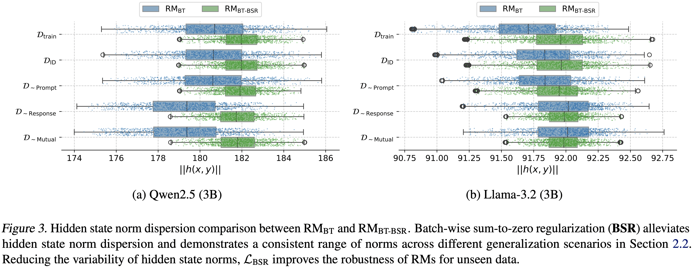

# [ICML 2025] On the Robustness of Reward Models in Language Model Alignment

[](https://arxiv.org/abs/2505.07271)
[](https://huggingface.co/collections/rm-robustness/icml-2025-robustness-in-rms-68213d98593a89fd5c8f892c)

This is the official repository for **[ICML 2025] On the Robustness of Reward Models in Language Model Alignment**.

<p align="center">
 
</p>

## **1. Training Reward Models**

We support five reward modeling objectives used in the paper. To apply **BSR**, set `use_batch_sum` to `true` in `.yaml` file.

```Shell
#!/bin/bash

export HF_HUB_ENABLE_HF_TRANSFER=1


ACCELERATE_LOG_LEVEL=info TRANSFORMERS_VERBOSITY=info TRAINING_TYPE=RM accelerate launch -m \
    --config_file accelerate/fsdp.yaml \
    scripts.run_alignment \
    recipes/samples/rm.yaml
```

## **2. Evaluation**


### **2.1 Validation 1 - In-domain (Binary Accuracy)**

For the tasks that require binary accuracy, we use `reward-bench` framework as their scoring systems are batch-invariant. Please make sure to pass `not_quantized` flag when running the code, especially for Llama-3 series. Also, their framework does not use the flash-attention by default, so we should set `--attn_implementation` to `flash_attention_2`.

```Shell
MODEL_NAMES=("rm-robustness/L31-8B-SKPv2-BSR-1e3")

for MODEL_NAME in "${MODEL_NAMES[@]}"; do
    echo "Evaluating Model: $MODEL_NAME"
    rewardbench --model="$MODEL_NAME" --batch_size 64 --not_quantized --torch_dtype bfloat16 --dataset linkedin-xfact/uf-val1-in-domain --attn_implementation flash_attention_2
done
```

### **2.2 Validation 2, 3, 4 - Out-of-domain (Kendall's $\tau$)**

For the validation sets 2, 3, and 4, we have four different resposnes per prompt. Thus, we use Kendall's $\tau$ as the metric to assess the alignment against the gold reward model. Below code evaluates the reward models on `val2-prompt-ood`, so you should explicitly mention which validation set you will use, and please adjust the `output_dir` correspondingly. We are using `liger-kernel` for faster inference.

```Shell
python scripts/run_kendall.py \
    --model_name_or_path=rm-robustness/L31-8B-SKPv2-BSR-1e3 \
    --output_dir=outputs/val2/ \
    --dataset_name=rm-robustness/ultrafeedback-valid-2-prompt-ood
```


## **3. Async RLHF**

You should specify `TRAINING_TYPE` to `RLOO` to launch RLHF with the trained reward models. We adopt the [Async RLHF framework](https://github.com/mnoukhov/async_rlhf), leveraging a separate vLLM thread for faster on-policy generation.

### **3.1. Remote RM**

We support deploying reward models on separate GPUs prior to actual training with Async RLHF. To use this mode, you need to run `run/deploy_rm.sh` before the actual training. With remotely deployed reward models, the training process will take `world size + 2` number of GPUs, two for remote RM and vLLM engine. This option requires to install `openrlhf==0.5.4`, but it enforces low versions for some core libraries like `deepspeed`. After installing openrlhf, deepspeed and transformers should be upgraded.

```Shell
#!/bin/bash

export HF_HUB_ENABLE_HF_TRANSFER=1


ACCELERATE_LOG_LEVEL=info TRANSFORMERS_VERBOSITY=info TRAINING_TYPE=RLOO accelerate launch -m \
    --config_file accelerate/ds3.yaml \
    scripts.run_alignment \
    recipes/samples/rloo.yaml
```